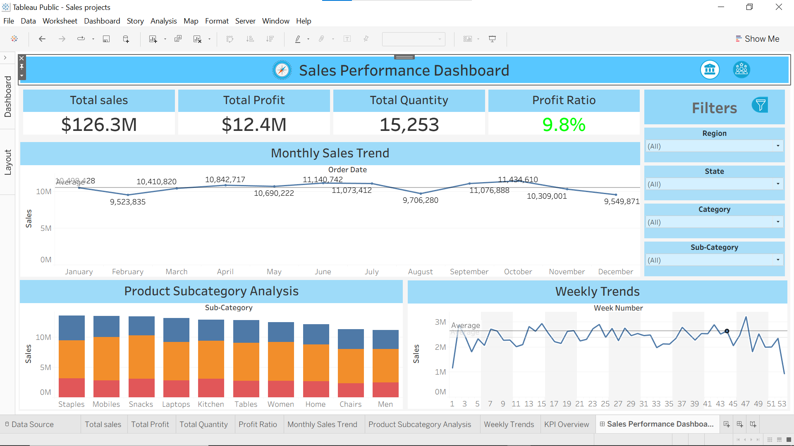

# 📊 Sales Performance Dashboard | Tableau Business Intelligence Project



## 📌 Project Summary

The Sales Performance Dashboard is an interactive Business Intelligence solution developed in Tableau to analyze organizational sales performance, profitability, customer demand, and product trends.

This dashboard transforms raw sales data into actionable business insights, enabling stakeholders to monitor KPIs, evaluate performance across dimensions, and support strategic decision-making through data-driven analysis.

---

## 🎯 Business Problem

Organizations generate large volumes of sales data but often struggle to extract meaningful insights that drive business growth.

This dashboard addresses key business questions such as:

- Which products contribute the most to revenue?
- How does sales performance vary over time?
- What is the overall profitability of the business?
- Which regions and categories perform best?
- Are there seasonal sales patterns?
- How do weekly sales trends fluctuate?

---

## 📈 Executive KPI Overview

The dashboard provides real-time monitoring of critical business metrics:

| KPI | Description |
|------|-------------|
| Total Sales | Overall revenue generated |
| Total Profit | Net profit earned |
| Total Quantity | Total units sold |
| Profit Ratio | Profitability percentage |

These KPIs provide a quick snapshot of overall business performance.

---

## 🔍 Dashboard Components

### 1️⃣ KPI Performance Cards

Executive-level summary cards highlighting:

- Revenue Performance
- Profitability
- Sales Volume
- Profit Margin

---

### 2️⃣ Monthly Sales Trend Analysis

Visualizes month-over-month sales performance to:

- Identify seasonality
- Detect growth opportunities
- Track business momentum
- Compare monthly performance

---

### 3️⃣ Product Sub-Category Analysis

Analyzes sales contribution across product sub-categories to:

- Identify top-performing products
- Detect low-performing segments
- Support inventory planning
- Improve product strategy

---

### 4️⃣ Weekly Trend Analysis

Tracks weekly sales movement to:

- Monitor short-term fluctuations
- Identify unusual performance spikes
- Analyze operational performance

---

### 5️⃣ Interactive Business Filters

Users can dynamically slice and analyze data using:

- Year
- Region
- State
- Category
- Sub-Category

This enables detailed drill-down analysis and self-service reporting.

---

## 📊 Key Business Insights

Through this dashboard, business users can:

✅ Monitor company-wide sales performance

✅ Evaluate profit generation efficiency

✅ Identify high-performing product segments

✅ Analyze seasonal purchasing behavior

✅ Compare sales across multiple dimensions

✅ Support strategic business planning

---

## 🛠️ Tools & Technologies

| Technology | Purpose |
|------------|----------|
| Tableau Public | Dashboard Development |
| Data Visualization | Business Reporting |
| Business Intelligence | Decision Support |
| Excel / CSV Dataset | Data Source |
| Data Analytics | Insight Generation |

---

## 📚 Skills Demonstrated

This project showcases the following analytical skills:

- Data Analysis
- Business Intelligence Reporting
- KPI Development
- Dashboard Design
- Data Visualization
- Trend Analysis
- Performance Monitoring
- Interactive Reporting
- Data Storytelling
- Business Insight Generation

---

## 📂 Repository Structure

```text
tableau-sales-performance-dashboard/
│
├── Datasets/
│
├── Sales projects.twb
│
├── Untitled.png
│
└── README.md
```

---

## 💼 Portfolio Value

This project demonstrates practical experience in building professional Business Intelligence dashboards commonly used by:

- Data Analysts
- Business Analysts
- Reporting Analysts
- MIS Analysts
- Operations Analysts

The dashboard reflects industry-standard reporting practices used in sales and performance management environments.

---

## 🚀 Future Enhancements

Potential improvements include:

- Customer Segmentation Analysis
- Profit Forecasting
- Regional Performance Mapping
- Year-over-Year Growth Analysis
- Predictive Analytics
- Automated Dashboard Refresh

---

## 👨‍💻 Author

### Abdussami Sayyed

Aspiring Data Analyst passionate about transforming data into actionable business insights.

🔗 LinkedIn: www.linkedin.com/in/abdussami-sayyed

🔗 GitHub: github.com/Abdussami-Sayyed

📧 Email: your-email@example.com

---

### ⭐ If you found this project valuable, consider giving it a star.